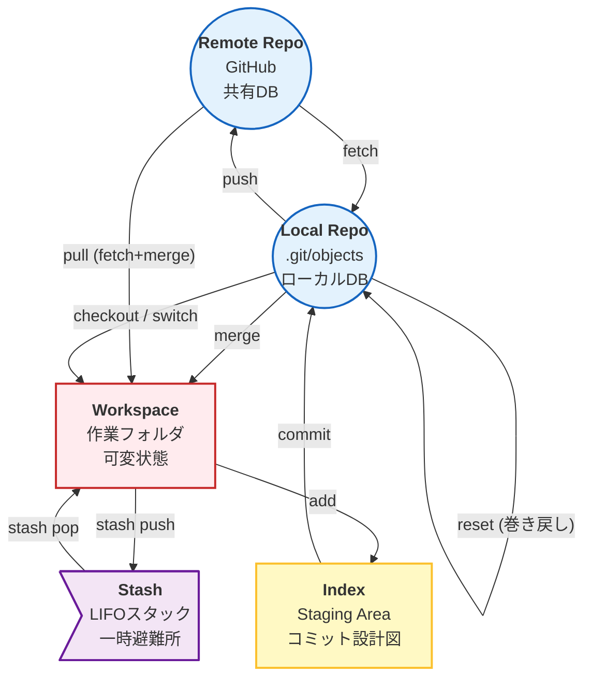
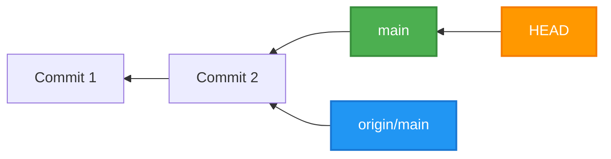
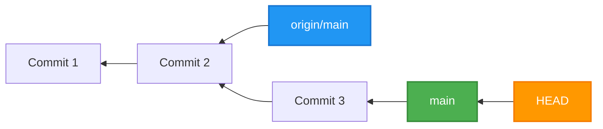
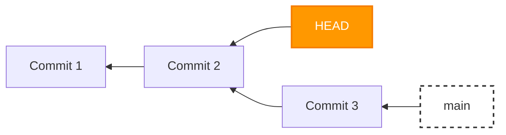

# Git応用編：同期と歴史操作 {#sec-git-advanced}

本稿は，「はじめてのGit / GitHub」（基礎編）において意図的に範囲外とした事項，すなわちブランチ・マージ・コンフリクト・pull／fetch・歴史操作（revert／reset）・stashを扱う続編である．基礎編で導入したワーキングツリー・インデックス・リポジトリという3つの場所，および`init`・`add`・`commit`・`push`という基本サイクルを既に理解していることを前提とする．

本稿では，複数の環境（例えば自宅のPCと外出先のタブレット）から同一のリポジトリを操作する場面を主な想定として，同期に伴って生じる事象と，その対処を整理する．

---

## 1. 保存領域の全体像 {#sec-storage-topology}

Gitは，4つの保存領域と1つのスタック領域との間で，データを移動させる仕組みであると整理できる．基礎編で導入したワーキングツリー・インデックス・ローカルリポジトリ・リモートリポジトリに，本稿では**Stash**という一時退避領域を加える．



各領域の性質を以下に整理する．

| 領域名 | 物理的実体 | 役割と特性 |
|---|---|---|
| Workspace（ワーキングツリー） | 目の前のファイル | 可変．エディタで編集している生のデータであり，Git管理外の状態も含まれる |
| Index（ステージング） | `.git/index` | バッファ．次のコミットに含まれる予定のファイル一覧とハッシュ値を保持する，緩衝領域に相当する |
| Local Repo（ローカルリポジトリ） | `.git/objects` | 不変DB．確定した歴史（コミット）が保存される．実体はハッシュチェーン構造を持つ |
| Remote Repo（リモートリポジトリ） | GitHubサーバー | 中央DB．複数の環境と同期するための共有ストレージ |

::: {#def-stash name="Stash"}
<br/>
Stashとは，作業中の未コミットの変更を一時的に退避させておくためのLIFO（後入れ先出し）スタックを指す．「急にfetchを行いたいが，現在の作業をコミットしたくない」という場面で用いられる．
:::

---

## 2. ポインタという考え方 {#sec-pointers}

Gitの挙動は，「ポインタ」と呼ばれる場所を示す名札を，どのコミットへ向けるかによって決まると整理できる．ここでは主要な3種のポインタを導入する．

::: {#def-head name="HEAD"}
<br/>
HEADとは，現在ワーキングツリーに展開されているコミットを指すポインタである．通常はブランチ名を経由して，間接的にコミットを指す．
:::

::: {#def-branch-pointer name="ブランチ"}
<br/>
ブランチ（例：`main`）とは，手元の歴史における最先端のコミットに付されたラベルを指す．新たなコミットが生成されるたびに，当該ブランチは自動的に新しいコミットへ移動する．
:::

::: {#def-remote-tracking-branch name="リモート追跡ブランチ"}
<br/>
リモート追跡ブランチ（例：`origin/main`）とは，前回の通信時点におけるリモートリポジトリ上のブランチの位置を記録したものを指す．`fetch`または`push`の実行時にのみ更新され，手動で移動させることはできない．
:::

### 2-1. 同期が取れている状態

`fetch`の直後で何らの変更も行っていない場合，3つのポインタはすべて同一のコミットを指す．



### 2-2. ローカルでコミットした状態

`git commit`を実行すると，歴史が1つ進む．HEADは`main`とともに新しいコミットへ移動するが，`origin/main`はその場に取り残される（サーバー側にはまだ伝達されていないためである）．



このポインタ間の「ずれ」が，いわゆる「pushしていない変更が存在する」状態に相当する．

### 2-3. 各コマンドによるポインタの動き

| コマンド | 動くポインタ | 動作の内容 |
|---|---|---|
| `git commit` | HEADと，HEADが指すブランチ | 新しいコミットを生成し，ブランチをそこへ進める．`origin/main`は動かないため，ローカルDBのみが更新される |
| `git fetch` | `origin/main`のみ | サーバーから最新情報を取得し，`origin/main`をサーバーの現在地まで進める．HEADや`main`には影響しないため，安全な「確認」操作である |
| `git merge origin/main` | HEADと`main` | `origin/main`の内容を`main`へ統合して進める |
| `git push` | リモートサーバー上の`main` | 手元の`main`の位置までサーバー側のポインタを進めさせる．通信成功後，手元の`origin/main`もこれに追従して更新される |
| `git checkout`／`git switch` | HEADのみ | HEADを別のブランチ，または過去のコミットへ付け替える．これによりワーキングツリーの内容が，その時点の状態へ書き換わる |

### 2-4. Detached HEAD

通常，HEADはブランチ名を経由して間接的にコミットを指す．これに対し，`git checkout <コミットID>`のように，ブランチを経由せず直接コミットを指す状態を**Detached HEAD**（分離したHEAD）と呼ぶ．



::: {.callout-important}
Detached HEADの状態でコミットを行っても，`main`ブランチは進まない．別のブランチへ移動すると，当該コミットはいずれのブランチからも参照されない状態となり，最終的に消滅する．歴史操作や，過去の状態を一時的に確認する目的で，この状態は意図せず生じることがある．
:::

---

## 3. 同期系コマンド {#sec-sync-commands}

データの移動を担うコマンド群を，送信と受信に分けて整理する．

### 3-1. 送信プロセス

1. **`git add`**（ワーキングツリー→インデックス）：ファイルのハッシュ値を計算し，Blobオブジェクトとして登録した上で，インデックスの一覧を更新する
2. **`git commit`**（インデックス→ローカルリポジトリ）：インデックスの状態を元にTreeオブジェクトを生成し，状態を凍結する．HEADの指すブランチが進む
3. **`git push`**（ローカルリポジトリ→リモートリポジトリ）：手元の歴史をサーバーへ転送し，サーバー側のポインタを更新する

### 3-2. 受信プロセス

4. **`git fetch`**（リモートリポジトリ→ローカルリポジトリ）：サーバーから最新データを取得するが，ワーキングツリーには反映しない．`origin/main`のみが更新されるため，安全な操作である
5. **`git merge`**（ローカルリポジトリ→ワーキングツリー）：fetchによって取得したデータと，手元のデータを統合する．ファイルの内容が書き換わるため，ここで[@def-conflict]が生じる可能性がある
6. **`git pull`**（リモートリポジトリ→ワーキングツリー）：`fetch`と`merge`を連続して実行する操作である．内容を確認せずに統合が行われるため，競合の発生時に意図しない結果を招くことがある．

$$
\text{pull} = \text{fetch} + \text{merge}
$$

---

## 4. 歴史操作系コマンド {#sec-history-operations}

ポインタをどのように動かすかによって，挙動が異なる一群のコマンドを扱う．破壊性の有無によって2種に分類する．

### 4-1. 非破壊的な操作

- **`git checkout`／`git switch`**（ローカルリポジトリ→ワーキングツリー）：指定した過去のコミットの状態を，ワーキングツリーへ展開する操作である．現在の作業内容は失われる（事前の退避が必要）が，歴史自体は破壊されない．
- **`git revert`**（ローカルリポジトリ→ローカルリポジトリ）：指定したコミットの逆変換を行う，新たなコミットを生成する操作である．状態$S$に操作$A$を加えた$S+A$に対し，操作$-A$を加えることで$S+A+(-A)=S$へ戻す，という考え方に相当する．歴史は未来に向かって進むため，push済みの変更を取り消す場合に適している．

### 4-2. 破壊的な操作

::: {.callout-important}
**`git reset`**（ローカルリポジトリ内でのポインタの強制移動）は，時間を遡る操作である．戻った地点より未来のコミットは参照を失い，最終的にガベージコレクションの対象となる．自分のみが作業している場合の修正に限り用いるべきであり，push後に実行すると，他者の歴史との不整合により重大な問題を招く．
:::

---

## 5. 緊急避難：Stash {#sec-stash}

**`git stash`**（ワーキングツリー⇄[@def-stash]）は，作業中の未コミットの変更を，一時的に[@def-stash]へ退避させる操作である．「急にfetchを行いたいが，現在の作業はコミットしたくない」という場面で利用する．退避させた変更は，`git stash pop`によってワーキングツリーへ復帰させることができる．

---

## 6. 同期時に生じる事故とその対処 {#sec-sync-trouble}

### 6-1. 枝分かれ（Divergent branches）

リモート（GitHub）とローカル（手元）の双方で，それぞれ独立に新しいコミットが生成された場合，歴史がY字型に枝分かれする．この状態に至ると，Gitは合流の方法を決定できず，操作を停止する．

これまで問題が生じなかったのは，手元に新しいコミットが存在しない状態が続いていたためである．この場合，Gitはリモートの最新版まで手元の状態を進めるだけで済む．これを**Fast-forward**（早送り）と呼ぶ．これに対し，手元でコミットを行った後に同期を行うと，リモートの変更と手元のコミットが衝突し，枝分かれが生じる．

### 6-2. マージ設定の固定

以下のコマンドにより，枝分かれが生じた際の合流方法を一つに定めることができる．

```bash
git config pull.rebase false
```

これにより，以降枝分かれが生じた場合には，自動的に**マージ**（合流コミットの作成）という方式によって解決されるようになる．

::: {#def-merge-rebase name="マージとリベースの違い"}
<br/>

- **マージ（Merge）**：2つの道筋を合流させ，新たな結節点（マージコミット）を作成する方式である．歴史は分岐した形のまま残るが，実際の経緯に忠実であり，安全性が高い．
- **リベース（Rebase）**：手元の変更履歴を，リモートの最新版の後方へ付け替える方式である．歴史は一直線に整理されるが，操作にはより高度な習熟を要する．
:::

### 6-3. 枝分かれと競合（コンフリクト）の違い

両者は異なる段階で生じる別種の問題であるため，区別して理解する必要がある．

- **枝分かれ**：合流の**方針**が未決定である段階の事象を指す
- **コンフリクト**：方針は決定済みであるが，**ファイルの内容**が衝突し，自動的な統合が行えない段階の事象を指す

::: {#def-conflict name="コンフリクト"}
<br/>
コンフリクトとは，複数の変更を統合する際に，同一箇所への変更が競合し，Gitが自動的に統合を行えない状態を指す．発生時には，ファイル内に`<<<<<<< HEAD`のような記号が挿入される．対処は次の手順による．

1. エディタ上に表示される選択肢（例：「両方の変更を取り込む」）から方針を選ぶ
2. ファイルの内容を整理した上で保存する
3. インデックスへ登録し，コミットを行う
:::

---

## 7. GUI上の表示記号 {#sec-gui-marks}

VS Codeのソース管理パネルに表示される記号は，これまでに導入した概念と以下のように対応する．

| 表示 | 意味 |
|---|---|
| `M`（Modified） | 修正されたファイルであることを示す |
| `U`（Untracked） | 新規に作成され，Gitの管理対象にまだ含まれていないファイルであることを示す |
| アスタリスク（`*`） | 保存（`Cmd + S`）またはコミットが未完了の，編集中のファイルであることを示す |
| HEAD | [@def-head]に対応する表示である |
| Origin | リモートリポジトリ（GitHub）を指す表示である |
| Staged | [@def-index]へ登録済みの状態を指す表示である |

---

## 8. ブランチの操作 {#sec-branch-operations}

- **作成**：画面左下に表示されている現在のブランチ名（例：`main`）を選択し，「新しいブランチ」を選ぶ
- **削除**：`main`へ一度移動した上で，不要なブランチを右クリックし，削除を選ぶ

::: {.callout-tip}
マージが完了したブランチは削除することが望ましい．不要なブランチを残さないことが，リポジトリを整理された状態に保つ上での原則となる．
:::

---

## 9. 複数環境を同期させる際の手順 {#sec-multi-env-workflow}

複数の環境（例：自宅のPCと外出先の端末）から同一のリポジトリを操作する場合，以下の手順に従うことで，事故の発生率を大きく下げることができる．

### 9-1. 作業開始時

1. **`git fetch`**を実行し，最新の情報を取得する
2. 他の環境での変更が存在するかを確認する
3. **`git merge`**（または`pull`）により，変更を手元へ取り込む

### 9-2. 作業終了時

1. **`git add .`**により，変更をインデックスへ登録する
2. **`git commit -m "update"`**により，ローカルリポジトリへ確定する
3. **`git push`**により，リモートリポジトリへ送信する

### 9-3. 誤りが生じた場合の対処

| 段階 | 対処 |
|---|---|
| push前 | VS Codeの「Undo Last Commit」機能，または`git reset --soft`を用いる |
| push後 | `git revert`により打ち消しコミットを作成する |

::: {.callout-tip}
作業を行う際には，「データは現在どこに存在するか」「各ポインタはどこを指しているか」の2点を意識すると，事象の把握が容易になる．
:::

---

## 用語さくいん（応用編） {#sec-glossary-advanced}

基礎編の用語さくいんに含まれない用語のみを以下に示す．

| 用語 | 内容 |
|---|---|
| Stash | [@def-stash]を参照 |
| HEAD | [@def-head]を参照 |
| ブランチ | [@def-branch-pointer]を参照 |
| リモート追跡ブランチ（`origin/main`） | [@def-remote-tracking-branch]を参照 |
| コンフリクト | [@def-conflict]を参照 |
| マージ／リベース | [@def-merge-rebase]を参照 |
| Fast-forward | リモートの最新版まで，手元の状態を単純に進めるだけで合流が完了する状態を指す |
| Divergent branches（枝分かれ） | リモートとローカルの双方で独立にコミットが生成され，歴史がY字型に分岐した状態を指す |
| Detached HEAD | HEADがブランチを経由せず，直接コミットを指している状態を指す（[@sec-pointers]を参照） |
| `git revert` | 指定したコミットを打ち消す，新たなコミットを作成する操作を指す |
| `git reset` | ポインタを過去の地点へ強制的に移動させる，破壊的な操作を指す |

---

## 本稿の範囲外とした事項

以下の事項については，本稿でも扱わない．必要が生じた時点で別途調査することとする．

- リベースの実際の操作手順（コンフリクト発生時の対処を含む）
- サブモジュール・サブツリーによる複数リポジトリの統合
- タグおよびGitHub Releaseを用いた節目の記録
- `.gitignore`の記述規則
